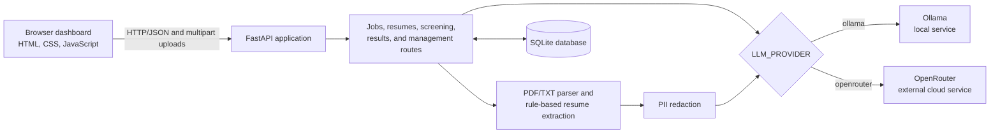
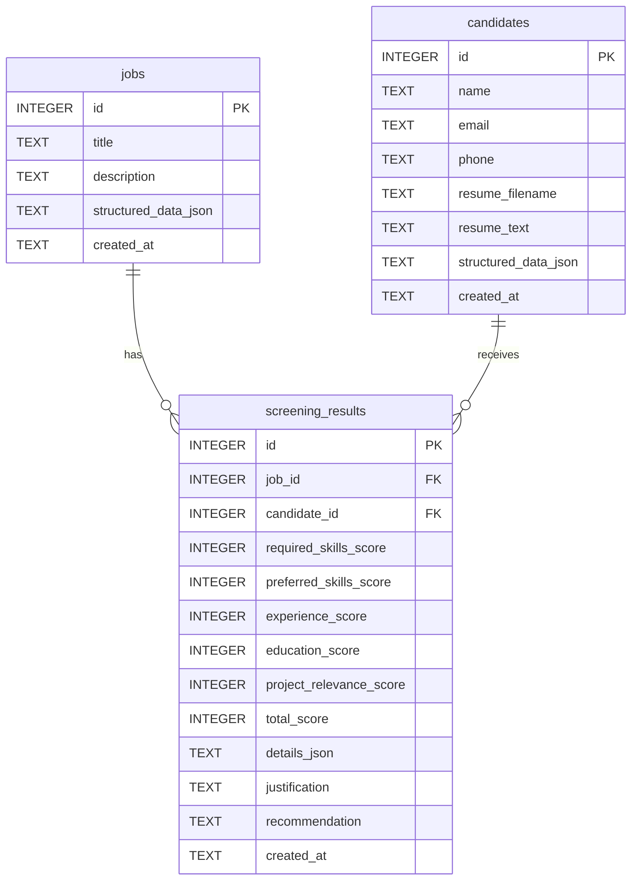

# Smart Resume Screener

> Extract job requirements, screen multiple resumes, and rank candidates with a selectable local Ollama model or OpenRouter cloud model.

[](https://www.python.org/)
[](https://fastapi.tiangolo.com/)
[](https://www.sqlite.org/)

## Overview

Smart Resume Screener is an educational recruitment-support application for comparing resumes with a saved job description. A recruiter creates a job in the browser dashboard, and the configured large language model (LLM) converts the description into structured requirements. The job and extracted requirements are stored in SQLite.

The recruiter can then upload as many as five PDF or TXT resumes for the selected job. The application extracts text and candidate details with local rules, replaces detected names, email addresses, and phone numbers before scoring, and sends the redacted resume plus the job description to the selected scoring provider. The LLM supplies the five component assessments; the application validates them, calculates the total and recommendation locally, stores the results, and displays candidates in ranked order.

Set `LLM_PROVIDER=ollama` to use a local Ollama service or `LLM_PROVIDER=openrouter` to select the OpenRouter integration. There is no automatic fallback and the two providers are not called together. See [Known limitations](#known-limitations) for two current provider-dispatch issues that affect OpenRouter screening and re-screening.

## Key features

- Create, structure, list, view, and delete saved jobs.
- Extract structured requirements from free-form job descriptions with the configured LLM.
- Parse text-based PDF and TXT resumes up to 5 MB each.
- Sanitize uploaded filenames and reject unsupported, empty, encrypted, damaged, or unreadable files.
- Extract candidate name, email, phone, known skills, and common resume sections with local rules.
- Redact detected name, email, and phone values before LLM scoring.
- Upload and screen as many as five resumes per job request.
- Preserve successful results when another file in the same upload fails.
- Validate structured LLM score components with Pydantic.
- Calculate the total score and recommendation locally.
- Persist jobs, original extracted resume text, candidate details, and results in SQLite.
- Rank results with deterministic tie-breakers.
- View a complete candidate result, re-screen it, or delete it.
- Delete jobs and clean up their results and orphaned candidates.
- Use a responsive HTML, CSS, and JavaScript recruiter dashboard.
- Explore the REST API through FastAPI's generated Swagger UI.

## Screenshots

The repository currently contains a `screenshots/` placeholder but no screenshot image files, so this README intentionally has no image links.

Useful screenshots to add are:

- Main dashboard
- Resume upload
- Candidate-detail view

## Architecture



The provider decision is made from `LLM_PROVIDER`; there is no automatic cloud fallback. Ollama keeps inference requests on the local machine. OpenRouter sends data to an external service.

## Application workflow

1. A recruiter creates a job from the dashboard or API.
2. The configured LLM extracts structured job requirements.
3. The raw description and structured requirements are saved in SQLite.
4. The recruiter selects the saved job.
5. The recruiter uploads one to five PDF or TXT resumes.
6. The application extracts resume text and rule-based candidate details.
7. Detected names, email addresses, and phone numbers are replaced in the scoring copy.
8. The configured LLM scores each redacted resume against the job description.
9. The application validates the component scores and calculates the total and recommendation locally.
10. Candidate and screening-result records are saved in one transaction per successful resume.
11. Results are sorted by score and displayed in the dashboard.

Files are processed sequentially to reduce provider rate-limit pressure. A failed file does not discard other successful files from the same request.

## Scoring rubric

| Category | Maximum score |
|---|---:|
| Required skills | 30 |
| Preferred skills | 10 |
| Experience relevance | 25 |
| Education relevance | 15 |
| Project relevance | 20 |
| **Total** | **100** |

The configured LLM returns the five component scores, matched and missing skills, evidence, and a justification. Pydantic validates each component's range. The application ignores any model-supplied total or recommendation and calculates both locally:

| Total score | Recommendation |
|---:|---|
| 80–100 | Strong Match |
| 60–79 | Potential Match |
| 0–59 | Not Recommended |

## Technology stack

| Technology | Role |
|---|---|
| Python 3.10+ | Backend language; the code uses modern union-type syntax |
| FastAPI 0.115.0 | REST API, validation integration, uploads, and generated API docs |
| Uvicorn 0.30.6 | ASGI development server |
| SQLite | Local persistence through Python's built-in `sqlite3` module |
| Pydantic | Request, response, provider-output, and score validation |
| httpx 0.28.1 | Asynchronous Ollama/OpenRouter requests and API test support |
| pypdf 3.15.1 | Text extraction from text-based PDFs |
| python-multipart 0.0.12 | Multipart resume uploads |
| python-dotenv 1.2.3 | `.env` configuration loading |
| Ollama | Local LLM serving; primary model is `qwen3.5:4b` |
| OpenRouter | Optional external cloud LLM provider |
| HTML, CSS, JavaScript | Dependency-free recruiter dashboard |

`requests` is also pinned in `requirements.txt` for a manual utility script. Pydantic is imported directly by the application but is currently installed transitively through FastAPI rather than pinned separately.

## Project structure

```text
SmartResumeScreener/
├── app/
│   ├── routes/          # FastAPI route modules
│   ├── schemas/         # Pydantic API and scoring models
│   ├── services/        # Parsing, redaction, LLM clients, and provider dispatch
│   ├── database.py      # SQLite connections, schema creation, and migration checks
│   └── main.py          # FastAPI application, routes, static mount, and startup
├── data/                # Runtime SQLite database location; database files are ignored
├── frontend/            # Dashboard HTML, CSS, and JavaScript served at /dashboard
├── sample_data/         # Development sample inputs and generated sample output
├── screenshots/         # Placeholder for future project screenshots
├── scripts/             # Manual provider checks and batch-screening utilities
├── static/              # Duplicate frontend assets; the app currently serves frontend/
├── tests/               # unittest test suite
├── .env.example         # Safe configuration template
├── .gitignore           # Local environment, database, cache, and editor exclusions
├── requirements.txt     # Pinned Python dependencies
└── README.md
```

The `scripts/` files are manual utilities and can make real provider requests; they are not part of the automated test suite.

## Prerequisites

- Windows 10/11, or another operating system that supports the selected Python and LLM tooling
- Python 3.10 or newer (the current project environment was verified with Python 3.13.13)
- Git
- Ollama when using local mode
- An OpenRouter account and API key only when using OpenRouter mode
- Enough free disk space and memory for the selected Ollama model

The official Ollama model listing reports `qwen3.5:4b` as an approximately 3.4 GB download. Leave additional space for Ollama, model metadata, the Python environment, and application data. See the [official model page](https://ollama.com/library/qwen3.5%3A4b) for current details.

## Installation

Run these commands in Windows PowerShell:

```powershell
git clone https://github.com/Siddeswar4Cyber/SmartResumeScreener.git
Set-Location .\SmartResumeScreener

py -3 -m venv .venv
.\.venv\Scripts\Activate.ps1

python -m pip install --upgrade pip
python -m pip install -r requirements.txt

Copy-Item .env.example .env
notepad .env
```

Choose and configure one provider in `.env`, then start the application:

```powershell
python -m uvicorn app.main:app --reload
```

No separate database initialization command is required. The FastAPI lifespan handler creates the `data/` directory and initializes or upgrades the SQLite schema during startup.

If PowerShell blocks virtual-environment activation, run the interpreter directly as `.\.venv\Scripts\python.exe`, or adjust the execution policy for the current process according to your organization's policy.

## Ollama setup

1. Install [Ollama for Windows](https://ollama.com/download/windows). Ollama normally runs in the background after installation.
2. Open a new PowerShell window and verify the CLI:

   ```powershell
   ollama --version
   ```

3. Download the primary local model:

   ```powershell
   ollama pull qwen3.5:4b
   ```

4. Confirm that it is installed:

   ```powershell
   ollama list
   ```

5. Start an interactive model test, then use `Ctrl+C` to exit:

   ```powershell
   ollama run qwen3.5:4b
   ```

6. Configure `.env`:

   ```dotenv
   LLM_PROVIDER=ollama
   OLLAMA_BASE_URL=http://127.0.0.1:11434
   OLLAMA_MODEL=qwen3.5:4b
   OLLAMA_TIMEOUT_SECONDS=300
   OLLAMA_NUM_CTX=8192
   ```

An OpenRouter key is not required for normal job creation and initial screening in Ollama mode. If memory pressure occurs, try `OLLAMA_NUM_CTX=4096`; a smaller context can reduce memory use but may limit how much job and resume text the model can consider. Re-screening is a current exception because that endpoint calls the OpenRouter client directly.

## OpenRouter setup

1. Create an API key in the [OpenRouter keys dashboard](https://openrouter.ai/settings/keys).
2. Copy `.env.example` to `.env` if you have not already done so.
3. Store the key only in `.env` and select a currently available model:

   ```dotenv
   LLM_PROVIDER=openrouter
   OPENROUTER_API_KEY=replace_with_your_own_key
   OPENROUTER_MODEL=nvidia/nemotron-3-super-120b-a12b:free
   ```

4. Never commit `.env`, copy the key into source code, or publish it in logs or screenshots.

Free model availability can change. A `404` can indicate that no provider is currently routing the selected model; a `429` indicates rate limiting. Try again later or select another model available to your OpenRouter account.

OpenRouter is external: job creation sends the job title and description, while screening sends the job description and the PII-redacted resume. Redaction is limited and is not complete anonymization. Use only fictional resumes while testing OpenRouter. Prefer Ollama for sensitive or real resumes.

**Current implementation note:** OpenRouter job-requirement extraction and the direct OpenRouter client are implemented, but the `LLM_PROVIDER=openrouter` initial-screening branch currently invokes the job extractor with screening arguments. That branch must be corrected before relying on OpenRouter for initial resume screening.

## Environment variables

Defaults below come from the application source. Values are loaded when the service modules are imported, so restart Uvicorn after changing `.env`.

| Variable | Required condition | Default | Purpose |
|---|---|---|---|
| `LLM_PROVIDER` | Optional | `ollama` | Selects `ollama` or `openrouter`; other values raise an application error |
| `OLLAMA_BASE_URL` | Optional in Ollama mode | `http://127.0.0.1:11434` | Base URL for the local Ollama API |
| `OLLAMA_MODEL` | Optional in Ollama mode | `qwen3.5:4b` | Ollama model used for job extraction and screening |
| `OLLAMA_TIMEOUT_SECONDS` | Optional in Ollama mode | `300` | HTTP timeout in seconds for an Ollama request |
| `OLLAMA_NUM_CTX` | Optional in Ollama mode | `8192` | Context-window size passed in Ollama request options |
| `OPENROUTER_API_KEY` | Required for OpenRouter calls and the current re-screen endpoint | Empty | Bearer token for OpenRouter; keep it only in `.env` |
| `OPENROUTER_MODEL` | Optional in OpenRouter mode | `nvidia/nemotron-3-super-120b-a12b:free` | OpenRouter model identifier |
| `OPENROUTER_APP_URL` | Optional | `http://localhost:8000` | Loaded as application metadata, but not currently sent in request headers |
| `OPENROUTER_APP_NAME` | Optional | `Smart Resume Screener` | Loaded as application metadata, but not currently sent in request headers |

The OpenRouter API endpoint is hard-coded as `https://openrouter.ai/api/v1/chat/completions`; `OPENROUTER_BASE_URL` is not an application setting.

## Running the application

Activate the environment and start Uvicorn from the repository root:

```powershell
.\.venv\Scripts\Activate.ps1
python -m uvicorn app.main:app --reload
```

Open:

- Dashboard: <http://127.0.0.1:8000/dashboard>
- Swagger documentation: <http://127.0.0.1:8000/docs>
- Health endpoint: <http://127.0.0.1:8000/api/health>
- ReDoc documentation: <http://127.0.0.1:8000/redoc>

The health endpoint verifies that SQLite can execute a query. It does not check Ollama or OpenRouter availability.

## API endpoints

| Method | Path | Purpose | LLM call? |
|---|---|---|---|
| `GET` | `/` | Return API status text and a documentation link | No |
| `GET` | `/api/health` | Check SQLite availability | No |
| `POST` | `/api/jobs` | Extract requirements and save a job | Yes — configured provider |
| `GET` | `/api/jobs` | List saved jobs, newest first | No |
| `GET` | `/api/jobs/{job_id}` | Return one job and its structured requirements | No |
| `DELETE` | `/api/jobs/{job_id}` | Delete a job, its results, and candidates left orphaned | No |
| `POST` | `/api/resumes/extract` | Extract and redact one to ten resumes without saving them | No |
| `POST` | `/api/jobs/{job_id}/screen` | Parse, redact, score, and save one to five resumes | Yes — configured dispatcher; see OpenRouter limitation |
| `GET` | `/api/jobs/{job_id}/results` | Return ranked results for a job | No |
| `GET` | `/api/screening-results/{result_id}` | Return one complete candidate screening result | No |
| `POST` | `/api/screening-results/{result_id}/rescreen` | Re-score a stored candidate and update the existing result | Yes — currently OpenRouter directly |
| `DELETE` | `/api/candidates/{candidate_id}` | Delete a candidate and its linked results | No |

The application also registers these supporting routes:

| Method | Path | Purpose |
|---|---|---|
| `GET` | `/dashboard` | Serve the recruiter dashboard |
| `GET` | `/static/{path}` | Serve files from `frontend/` when that directory exists |
| `GET` | `/docs` | Swagger UI |
| `GET` | `/redoc` | ReDoc UI |
| `GET` | `/openapi.json` | Generated OpenAPI schema |
| `GET` | `/docs/oauth2-redirect` | Swagger UI OAuth redirect helper |

## Database design

SQLite data is stored at `data/resume_screener.db`. The file is created when needed and excluded by `.gitignore` through `data/*.db`.



Each screening result belongs to one job and one candidate. The `(job_id, candidate_id)` pair is unique. Both foreign keys use `ON DELETE CASCADE`, and foreign-key enforcement is enabled for every managed connection. The API's delete operations explicitly remove related results so they can return deletion counts; deleting a job also removes candidate records that no longer have any result for another job.

The `jobs.structured_data_json`, `candidates.structured_data_json`, and `screening_results.details_json` columns store validated or extracted structured data as JSON text. The original extracted resume text is stored unredacted in `candidates.resume_text` for details and re-screening.

## Testing

Compile the application and run the standard library test suite from the repository root:

```powershell
python -m compileall app
python -m unittest discover -s tests -v
```

There is no pytest configuration in the repository. Tests cover:

- Rule-based candidate details, skills, sections, and PII redaction
- Model JSON extraction, score validation, and local outcome calculation
- Job creation, listing, retrieval, normalization, and schema migration
- Resume screening transactions and rollback behavior
- Ranked results and deterministic tie-breakers
- Candidate details, re-screening, deletion, and job cleanup
- Dashboard delivery, static assets, DOM controls, and basic browser-safety checks

The suite replaces LLM/HTTP interactions with mocks and should not contact Ollama or OpenRouter. Because one job-creation test is written around the OpenRouter mock, a local `.env` containing `LLM_PROVIDER=ollama` can cause that test to follow the wrong branch. For a deterministic run of the current suite in PowerShell:

```powershell
$env:LLM_PROVIDER = "openrouter"
python -m unittest discover -s tests -v
```

Verification for this README used the project virtual environment: `compileall` completed successfully, and all 69 tests passed with the explicit provider override. The same tests were not sent to a real external provider.

## Usage example

1. Create a fictional **Backend Developer Intern** job with Python, FastAPI, SQL, Git, REST API, education, and project requirements.
2. Select the new job and review its extracted required and preferred skills.
3. Upload one or more fictional PDF or TXT resumes. Do not use a real person's resume or contact details for a cloud-provider test.
4. Start screening and review any per-file failures without losing successful results.
5. Open the ranked candidate cards and inspect evidence, missing skills, score components, and justification.
6. Open a candidate's detail view to re-screen or delete the record when appropriate.

## Privacy and security

- `.env` and `.env.*` are excluded from Git, except for the safe `.env.example` template.
- SQLite `data/*.db` files are excluded from Git.
- Real resumes are **not** globally excluded by file type; do not add or commit them to the repository.
- Uploaded filenames are reduced to their final path component before use.
- Uploads are restricted to `.pdf` and `.txt`, limited to 5 MB, and checked for empty content; PDFs also receive a basic `%PDF` signature check.
- Detected name, email, and phone values are replaced before candidate scoring.
- The prompts instruct the model to treat job descriptions and resumes as untrusted data, ignore embedded instructions, use explicit evidence, and avoid protected characteristics. Prompt instructions reduce risk but do not guarantee prompt-injection resistance.
- Ollama sends inference requests to the configured local Ollama URL and is the recommended mode for sensitive or real resumes.
- OpenRouter is an external cloud service. The application sends job content and a redacted resume to it during screening.
- Redaction is rule-based and limited. It may miss identifiers and must not be described as complete anonymization.
- The original extracted resume, detected contact information, and structured candidate data are stored unredacted in the local SQLite database.
- The dashboard asks for confirmation before deleting a job or candidate. It also confirms before re-screening because that operation replaces the saved assessment.
- API endpoints have no authentication or authorization. Do not expose the development server to an untrusted network.

This project is an educational screening aid. It must not make final hiring decisions without meaningful human review.

## Known limitations

- Scanned or image-only PDFs require OCR, which is not implemented.
- DOCX and other resume formats are not supported.
- Rule-based extraction may miss uncommon layouts, names, phone formats, skills, or section headings.
- PII redaction is limited to detected names, email addresses, and realistic phone-number patterns and is not guaranteed to remove every identifier.
- Small local models may produce less consistent job extraction and scoring.
- Free OpenRouter models may be unavailable, rate-limited, or changed by the provider.
- The `LLM_PROVIDER=openrouter` initial-screening branch currently calls the job extractor with screening arguments and needs correction.
- Re-screening currently imports the OpenRouter client directly and does not honor `LLM_PROVIDER`.
- Screening quality depends on the completeness and accuracy of the job description and resume text.
- LLM evidence and scores may be wrong or biased and require human verification.
- SQLite is appropriate for this local project but is not automatically suitable for a multi-user production deployment.
- There is no authentication, recruiter-account separation, role-based access control, background task queue, or deployment configuration.
- Original resume text and contact details are retained locally until their candidate or related job is deleted.

## Troubleshooting

### Ollama connection refused

Confirm that Ollama is running, then check the configured endpoint:

```powershell
ollama --version
Invoke-RestMethod http://127.0.0.1:11434/api/tags
```

Keep `OLLAMA_BASE_URL=http://127.0.0.1:11434` unless Ollama is intentionally hosted elsewhere. Restart Uvicorn after changing `.env`.

### Ollama model not found

Pull the exact configured tag and verify it:

```powershell
ollama pull qwen3.5:4b
ollama list
```

Make `OLLAMA_MODEL` match an installed tag exactly.

### Ollama timeout or empty response

Increase `OLLAMA_TIMEOUT_SECONDS`, shorten unusually long input, and confirm the model responds with `ollama run qwen3.5:4b`. The application already allows up to 300 seconds by default and reports empty model content as an error.

### GPU or memory pressure

Close other memory-intensive applications, try `OLLAMA_NUM_CTX=4096`, or select a smaller compatible model. A lower context value can truncate the useful context available to the model.

### OpenRouter API key missing

Set `OPENROUTER_API_KEY` in `.env`, ensure `LLM_PROVIDER=openrouter`, and restart Uvicorn. Never put the key in Python or JavaScript source.

### OpenRouter `404` provider-routing error

Check the model identifier and current provider availability in OpenRouter. Free routes are not guaranteed to remain available; choose another model if needed.

### OpenRouter `429` rate limit

Wait before retrying, process smaller batches, or use a model/account with sufficient limits. Screening already processes files sequentially, but separate requests can still exceed provider limits.

### Invalid or empty model JSON

Confirm the selected model supports reliable structured output. Retry once, inspect the safe API error, and try a more capable model. The application strips common Markdown fences, extracts JSON, validates required fields and score ranges, and rejects invalid results instead of saving them.

### Unsupported file or file too large

Upload a non-empty `.pdf` or `.txt` file no larger than 5 MB. Password-protected PDFs, damaged PDFs, and files whose content does not match a `.pdf` extension are rejected.

### Scanned PDF has no extractable text

Convert it with an OCR tool first, then upload the searchable PDF or exported TXT file. OCR is not included in this project.

### Database schema error

Stop the app and back up `data/resume_screener.db` before making changes. Startup creates missing tables and handles a small set of known legacy column renames, but it is not a general migration system. For disposable development data only, move the database aside and restart the app to create a new one.

### Port 8000 is already in use

Start on another port:

```powershell
python -m uvicorn app.main:app --reload --port 8001
```

Then use `http://127.0.0.1:8000/dashboard` and update `OPENROUTER_APP_URL` if you use that metadata value.

### Frontend static files do not load

Run Uvicorn from the repository root, confirm that `frontend/index.html`, `frontend/styles.css`, and `frontend/app.js` exist, and hard-refresh the browser. The application mounts `frontend/` at `/static`; the root-level `static/` directory is not the active mount.

### `ModuleNotFoundError` for FastAPI or another package

Activate `.venv` and install the pinned dependencies:

```powershell
.\.venv\Scripts\Activate.ps1
python -m pip install -r requirements.txt
```

## Future improvements

- Authentication, recruiter accounts, and role-based permissions
- OCR for scanned and image-only PDFs
- DOCX resume support
- PostgreSQL and formal database migrations
- Background tasks and progress reporting for larger batches
- Better audit logging without exposing resume content or secrets
- Human feedback, score calibration, and evaluation datasets
- Additional accessibility review and usability testing
- Production deployment configuration
- Configurable scoring rubrics and recommendation thresholds
- Consistent provider dispatch for both initial screening and re-screening

## Ethical-use notice

Smart Resume Screener assists human reviewers; it must not be the sole basis for interviewing, rejecting, or hiring a candidate. Do not use or infer protected characteristics when screening. LLM outputs and local extraction rules can contain errors or bias, so recruiters must inspect the cited resume evidence and verify qualifications manually. Candidates should have access to a meaningful human-review or appeal process when an automated assessment affects them.

## Contributing

Contributions are welcome when they preserve candidate privacy and include appropriate tests:

1. Fork the repository and create a focused branch.
2. Keep secrets, real resumes, and generated database files out of commits.
3. Add or update tests for behavior changes.
5. Open a pull request describing the change, privacy impact, and verification performed.